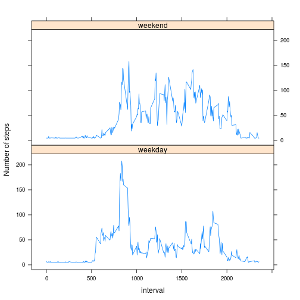

## Reproducible Research: Peer Assessment 1


### Clone the link from git, and unzip activity data. Load activity data and transform the date to date format

```r
activity<-read.csv("activity.csv",header=T,colClasses=c("numeric","character","integer"))
activity<-transform(activity,date=as.Date(date))
```


### The mean total number of steps taken per day is around 10765 steps.

```r
## sum steps by date
actT<-aggregate(steps~date,data=activity,sum,na.rm=T)

## plot histogram of the total steps by day
with(actT,hist(steps))
```

 

```r
## compute mean and median
mean(actT$steps)
```

```
## [1] 10766
```

```r
median(actT$steps)
```

```
## [1] 10765
```

### The average daily daily steps starts rising at 5:40am, and peak at 8:35am and reduces after 9:30am, it osicilates during the day and fall downs after 21:40pm

```r
## sum steps by 5-minutes interval ##
library("plyr")
act5<-subset(activity,complete.cases(activity))  #remove NA cases
act5m<-ddply(act5,.(interval),summarize,sum=sum(steps,na.rm=T),count=length(date))

## plot time series plot of 5-minutes interval ##
act5m$average<-round(act5m$sum/act5m$count,2) ##calculate average steps

with(act5m,plot(interval,average,type="l"))
```

 

```r
with(act5m,interval[average==max(average)])
```

```
## [1] 835
```

### 8 days missing value is filled as average 5-minutes steps which is around 37 steps.

```r
actimp<-activity
actimp$steps[which(!complete.cases(actimp))]<-round(mean(act5m$average),2)

## mutate new mean and median from fill-in data
actimpT<-aggregate(steps~date,data=actimp,sum)

## plot histogram of the total steps by day
with(actimpT,hist(steps))
```

 

```r
mean(actimpT$steps)
```

```
## [1] 10766
```

```r
median(actimpT$steps)
```

```
## [1] 10765
```

### Weeddays has more regulated pattern which has a peak at 8:35am, while weekend osicilating and less activity steps in average.

```r
## identify weekday and weekend and get 5-minutes interval
tomatch<-weekdays(actimp$date)=="Saturday" | weekdays(actimp$date)=="Sunday"
actimp$workday<-ifelse(tomatch,"weekend","weekday")
act5mimp<-ddply(actimp,.(interval,workday),summarize,sum=sum(steps,na.rm=T),count=length(date))
act5mimp$average<-round(act5mimp$sum/act5mimp$count,2)

## plot average by 5-minutes interval by weekday and weekend
library("lattice")
xyplot(average~interval|workday,act5mimp,horizontal=F,type="l",
       ylab="Number of steps",layout=c(1,2))
```

 

